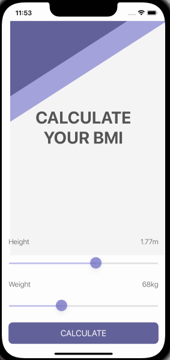
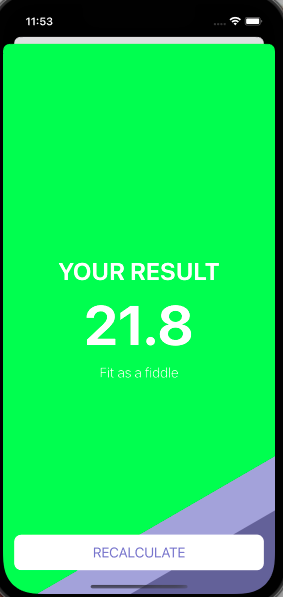

# BMICalculator - Jose Abel Ramirez Frontany




## Built With

- iOS
- Xcode
- Swift

## Getting Started

To get a local copy up and running follow these simple example steps.

### Setup

Go to the top of the page, press the green button that says "Code", and copy the link. Then you have to go to your console and type

```
    git clone 'repository-link'
```

You can also create a new file in your local Xcode IDE and choose clone project from Github, paste the Github link for this project and that's all, you are ready to go!


## Author: Jose Abel Ramirez Frontany\*\*

- GitHub: [Jose Abel Ramirez Frontany](https://github.com/jose-Abel)
- Linkedin: [Jose Abel Ramirez Frontany](www.linkedin.com/in/joseabelramirezfrontany)

## 🤝 Contributing

Contributions, issues, and feature requests are welcome!

## 📝 License

This project is MIT licensed.

## Show your support

Give a ⭐️ if you like this project!